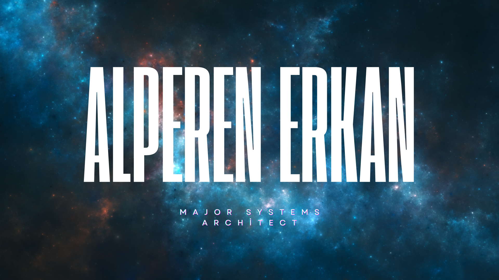

  

## Skills 

  

  <h2></h2>
   

  
  
  
  
  
   
  <h2></h2>

> Contribution history prior to May 2026 reflects the migration of active development commits from my legacy/previous repository systems (NeOx-Ghost / NeOx-Kernel).

<!--  

<h1 align="center">Alperen ERKAN</h1>

  
  
  
  
  
  
  

--!>

