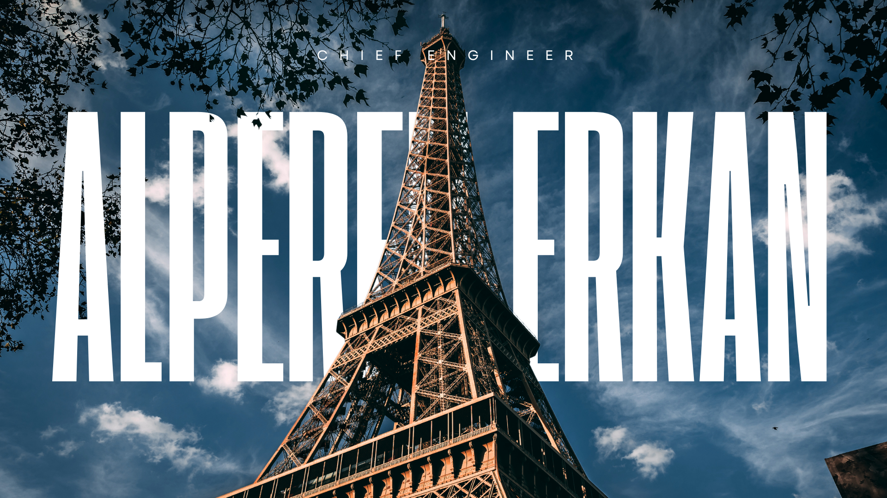

  

## Skils

  

> [!NOTE]
> Contribution history prior to May 2026 reflects the migration of active development commits from my legacy/previous repository systems (NeOx-Ghost / NeOx-Kernel).

  

<!--  

<h1 align="center">Alperen ERKAN</h1>

  
  
  
  
  
  
  

--!>

